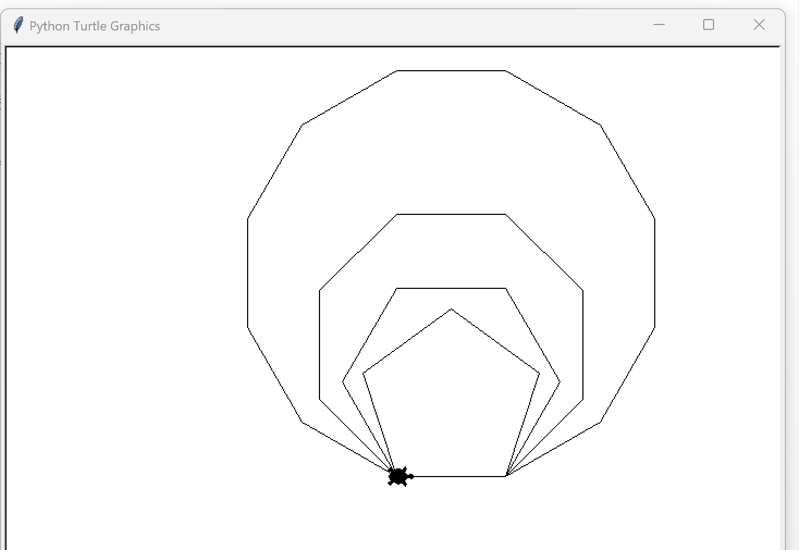

# README 파일이란?

## 이곳은 저장소에 대한 설명을 작성합니다

### 마크다운 문법을 사용합니다

# 가로줄 넣기

---

- - - -

****

* * *

# 깃허브

1. 원격 저장소 만들기

2. origin 연결

3. push/pull

4. 협업

- 스테이지
- 커밋
- 풀리퀘스트
  -요청
  -허용

# 텍꾸

**git hub**는 *원격 저장소*를 제공하~는 서비스이~기 때문에

온라인 상에서 git의 ***버전 관리 기능***을 사용할 수 있습니다.

